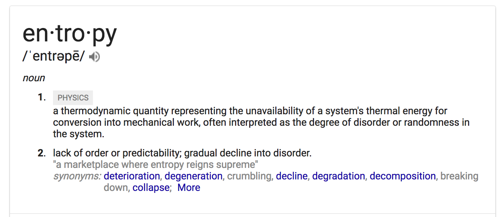
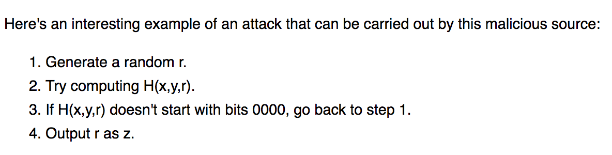
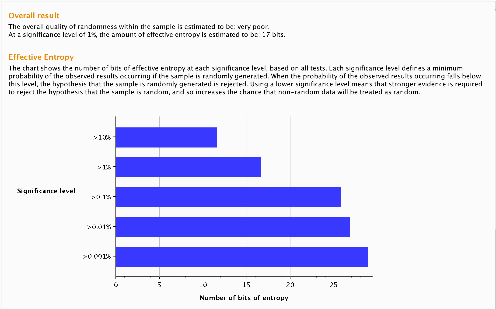
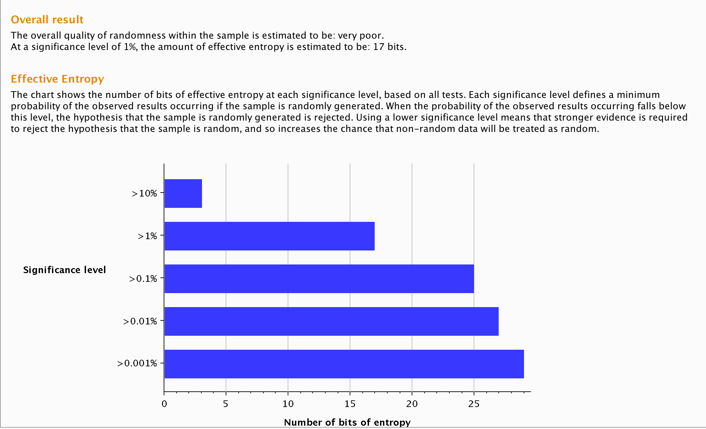
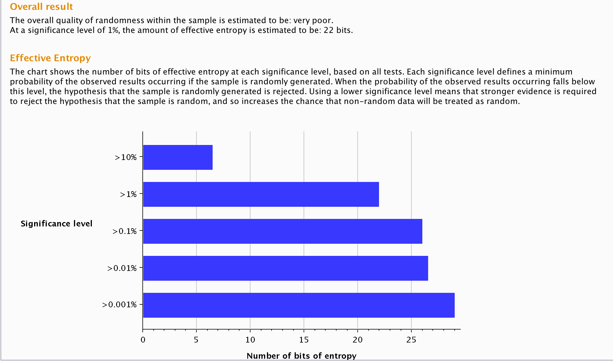

# Make Love! -- The lojikil way

**part 0**: the heart is a random thing

---

# wtf loji?

- what *are* random numbers?
- what delineates *random*?
- what are random *number generators*?
- and how do they work?

---

# A POX UPON CLAN CALLAHAN

- we saw MD5/SHA1 in client code (we thought)
- looked through impl
- realized we didn't *exactly* know how csPRNGs were implented...
- made this talk

---

# random numbers

- statistically, numerically, and bit-level random
- multiple tests 
- multiple sources [hardware, weather data, disk reads...]

---

# ... but really... random?

- entropy
- naturally occuring sources
- mixed pools



---

# RNGs

- multiple styles: psuedo-random, hardware, cryptographically secure pseudo-random...
- blame Callahan

---

# RNGs (cont.)

- period: the number of values generated before the cycle begins again
- seed (or seed state): initial values for the RNG
- distribution, correlation, &c. all as normal

---

# PRNG

- simple mathematical formula
- easy to implement (LCG ≈ 1 line of code)
- `X[n + 1] = (a * X[n] + c) mod m`
- `a`, `c`, `m` all have mathematical relationships

---

# Linear Congruential Generator

```
uint64_t seed = 2592, a = 25214903917, c = 11;
uint64_t tmp = 0, mod = 0xDEADBEEF54;
uint64_t
lcg(uint64_t mod, uint64_t a, uint64_t c, uint64_t seed) {
    return ((a * seed) + c) % mod;
}
```

---

# Pros/Cons

Pros:
- easy to understand
- fast
- easy to implement

Cons:
- small period
- those magic numbers matter
- easy to fuck up

---

# enter: cryptographically secure PRNGs

- entropy pools
- mixed operations (mixed hashing & encrypting cycles)
- re-keying

---

# Entropy pools

- think back to the hardware slide
- collect "entropy" from other sources

---

# ... so more data == better?



*from https://blog.cr.yp.to/20140205-entropy.html*

---

# arc4random

- `getentropy`
- fill buffer pool (per process)
- `arc4(buffer data)`
- **_RANDOM!_**

---

# arc4random (cont.)

```
/* from OpenBSD */
u_int32_t
arc4random(void)
{
	u_int32_t val;

	_ARC4_LOCK();
	_rs_random_u32(&val);
	_ARC4_UNLOCK();
	return val;
}
```

---

# Yarrow-ish

- "simple" algorithm
- can use any hash/block cipher

---

# Yarrow-ish (cont.)

- `E()` := XTea (64-bit block cipher)
- `Pg` := n/3 ~~ 21
- Key := random (chosen by fair roll of dice)
- Repool ever `Pg` block outputs
- Counter = (0 -> inf) mod key size
- output: `E(counter, key)`

--- 

# XTea

```
void
encipher(uint32_t* v, uint32_t* k)
{
    uint32_t v0=v[0], v1=v[1], i;
    uint32_t sum=0, delta=0x9E3779B9;
    for(i=0; i < 64; i++)
    {
        v0 += (((v1 << 4) ^ (v1 >> 5)) + v1) ^ 
        (sum + k[sum & 3]);
        sum += delta;
        v1 += (((v0 << 4) ^ (v0 >> 5)) + v0) ^ 
        (sum + k[(sum>>11) & 3]);
    }
    v[0]=v0;
    v[1]=v1;
}
```

---

# XTea

- broken, but whatever
- simple block cipher
- encipher == decipher (kinda)

---

# Yarrow-ish (setup)

```
uint64_t
xtea_rand() {
    static uint32_t blocks_output = 0, key[4] = {0x00000000, 0x3b6e20c8, 0x76dc4190, 0x4db26158};
    static uint64_t ctr = 0;
    uint32_t vcounter[2] = {0};
    uint64_t res = 0;
    time_t t = 0;

    vcounter[0] = time(&t);
    vcounter[1] = t + ctr;
```

---

# Yarrow-ish (rotation of key)

```
    if(blocks_output >= 21) {
        encipher(&vcounter[0], &key[0]);
        key[0] = vcounter[0];
        key[1] = vcounter[1];
        vcounter[0] = time(&t);
        vcounter[1] = ctr + 1;
        encipher(&vcounter[0], &key[0]);
        key[2] = vcounter[0];
        key[3] = vcounter[1];
        vcounter[0] = time(&t);
        vcounter[1] = ctr + 2;
        ctr += 2;
    }
```

--- 

# Yarrow-ish encrypt

```
    encipher(&vcounter[0], &key[0]);
    res = (vcounter[0] << 32) + vcounter[1];
    blocks_output += 1;
    ctr += 1;
    return res;
}
```

---

# Testing

- "rigorous" testing: 20k samples from each
- "rigorous" testing: Burp Sequencer 

---

# Results!

aka "who cares?" (Russian Accent)

- all three suck
- but one sucks less than the others!

---

# LCG

~ 17 bits of entropy



---

# arc4random

~ 17 bits of entropy



---

# Yarrow-ish

~ **22** bits of entropy!



---

# Summary

- csPRNG == entropy pools + cipher
- in ~60 lines, created a less shitty sys than both LCG **and** arc4random
- ... but still pretty shitty

---

# Thanks!

- Questions?

